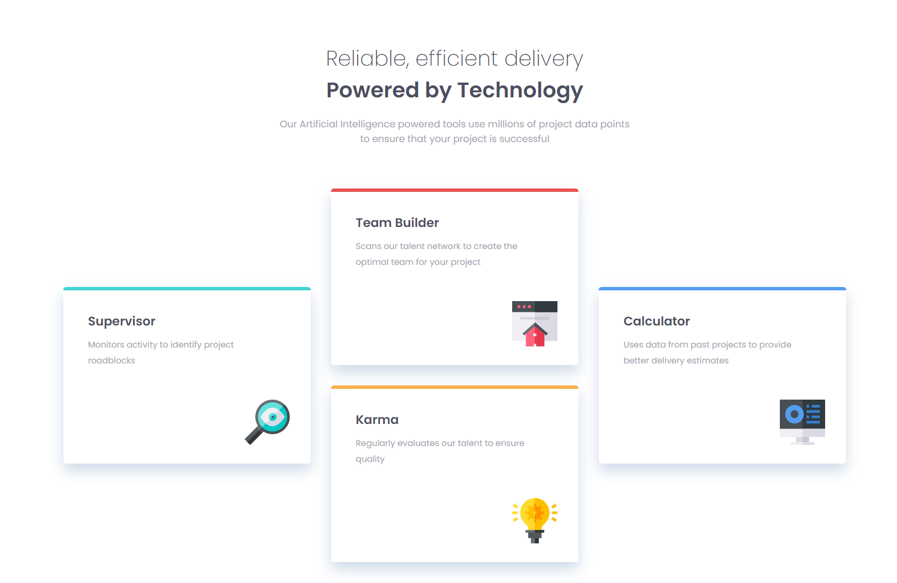
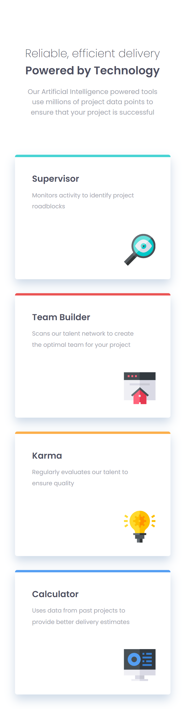

# Frontend Mentor - Four card feature section solution

This is a solution to the [Four card feature section challenge on Frontend Mentor](https://www.frontendmentor.io/challenges/four-card-feature-section-weK1eFYK). Frontend Mentor challenges help you improve your coding skills by building realistic projects. 

## Table of contents

- [Overview](#overview)
  - [The challenge](#the-challenge)
  - [Screenshot](#screenshot)
- [My process](#my-process)
  - [Built with](#built-with)
  - [What I learned](#what-i-learned)
  - [Continued development](#continued-development)
- [Author](#author)

## Overview

### The challenge

Users should be able to:

- View the optimal layout for the site depending on their device's screen size

### Screenshot

## My process

### Built with

- Semantic HTML5 markup
- CSS custom properties
- Flexbox
- CSS Grid

### What I learned

This project was great because it helped me to develop my understanding of when to use Grid, Flexbox and positioning. The main card section is structured through grid-template-areas whereas the content inside the columns and the header uses flexbox. I also used position absolute to align the icons inside the cards.

This was the first project I have done so far where I felt like I used CSS selectors appropriately to keep my CSS clean and easy to understand.

### Continued development

I need to keep practising!

## Author

- Frontend Mentor - [@MissEmMcCarthy](https://www.frontendmentor.io/profile/MissEmMcCarthy)
- Twitter - [@MissEmMcCarthy](https://twitter.com/MissEmMcCarthy)